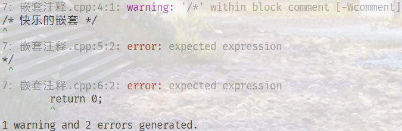

## 练习1.1

> 查阅你使用的编译器的文档，确定它所使用的文件命名约定。编译并允许第2页的main程序
* [为 Visual C++ 项目创建的文件类型](https://docs.microsoft.com/zh-cn/cpp/build/reference/file-types-created-for-visual-cpp-projects?view=vs-2019)
* [Using GCC with MinGW](https://code.visualstudio.com/docs/cpp/config-mingw)

## 练习1.2

> 改写程序，让它返回-1。返回值-1通常被当作程序错误的标识。重新编译并运行你的程序，观察你的系统如何处理main返回的错误标识。
! [windows](exersice1_2.png)

## [练习1.3](3：Helloworld.cpp)

> 编写程序，在标准输出上打印 Hello, World。

## 练习1.4

> 我们的程序使用加法运算符+来将两个数相加。编写程序使用乘法运算符*，来打印两个数的积。
``` c++
#include <iostream>
int main(void){
    std::cout << "Enter two numbers:" << std::endl;
    int v1 = 0,v2=0;
    std::cin >> v1 >> v2;
    std::cout << "The product of" << v1 << "and" <<
                v2 << "is" << v1 * v2 << std::endl;
    return 0;
}
```

## 练习1.5

> 我们将所有输出操作放在一条很长的语句中。重写程序，将每个运算对象的打印操作放在一条独立的语句中。
``` c++
#include <iostream>
int main(void){
    std::cout << "Enter two numbers:" << std::endl;
    int v1 = 0,v2=0;
    std::cin >> v1 >> v2;
    std::cout << "The product of" 
    std::cout << v1 
    std::cout << "and" 
    std::cout << v2 
    std::cout << "is" 
    std::cout << v1 * v2 
    std::cout << std::endl;
    return 0;
}
```

## 练习1.6

> 解释下面程序片段是否合法。
```
std::cout << "The sum of " << v1;
		  << " and " << v2;
		  << " is " << v1 + v2 << std::endl;
```
如果程序是合法的，它的输出是什么？如果程序不合法，原因何在？应该如何修正？

不合法
分号分隔为多个语句，后面语句部分缺失
去除多余分号

## 练习1.7

> 编译一个包含不正确的嵌套注释的程序，观察编译器返回的错误信息。

```c++
int main()
{
/*	
/* 快乐的嵌套 */
*/
	return 0;
}
```
编译器错误信息：



## 练习1.8

> 指出下列哪些输出语句是合法的(如果有的话)：
```c++
std::cout << "/*";
std::cout << "*/";
std::cout << /* "*/" */;
std::cout << /* "*/" /* "/*" */;
```
预测编译这些语句会产生什么样的结果，实际编译这些语句来验证你的答案(编写一个小程序，每次将上述一条语句作为其主体)，改正每个编译错误。

第三行出错，改为
```c++
std::cout << /* "*/" */";
```
## [练习1.9](9：while.cpp)

> 编写程序，使用while循环将50到100的整数相加。

## [练习1.10](10：--.cpp)

> 除了++运算符将运算对象的值增加1之外，还有一个递减运算符（--）实现将值减少1。编写程序，使用递减运算符在循环中按递减顺序打印出10到0之间的整数。

## [练习1.11](11：range.cpp)

> 编写程序，提示用户输入两个整数，打印出这两个整数所指定的范围内的所有整数。

## 练习1.12

> 下面的for循环完成了什么功能？sum的终值是多少？
```
int sum = 0;
for (int i = -100; i <= 100; ++i)
	sum += i;
```

从 -100 加到 100 ，终值为 0。

## [练习1.13](13：for.cpp)

> 使用for循环重做1.4.1节中的所有练习（第11页）。